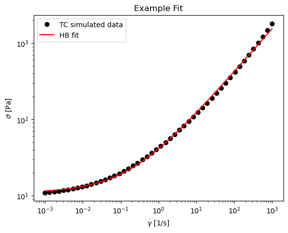

# rheomodel

Collection of rheology flow curve models


```python
import lmfit
import rheomodel as rm
import pandas as pd
import numpy as np
import matplotlib.pyplot as plt

model=lmfit.Model(rm.HB)
model.param_names
```


    ['ystress', 'K', 'n']


```python
x=np.logspace(-3,3)
data=pd.DataFrame({'Shear rate':x,'Stress':rm.TC(x,ystress=10,gammadot_crit=0.1,eta_bg=0.8)})
data.head()
```


<div>
<style scoped>
    .dataframe tbody tr th:only-of-type {
        vertical-align: middle;
    }

    .dataframe tbody tr th {
        vertical-align: top;
    }

    .dataframe thead th {
        text-align: right;
    }
</style>
<table border="1" class="dataframe">
  <thead>
    <tr style="text-align: right;">
      <th></th>
      <th>Shear rate</th>
      <th>Stress</th>
    </tr>
  </thead>
  <tbody>
    <tr>
      <th>0</th>
      <td>0.001000</td>
      <td>11.000800</td>
    </tr>
    <tr>
      <th>1</th>
      <td>0.001326</td>
      <td>11.152456</td>
    </tr>
    <tr>
      <th>2</th>
      <td>0.001758</td>
      <td>11.327117</td>
    </tr>
    <tr>
      <th>3</th>
      <td>0.002330</td>
      <td>11.528282</td>
    </tr>
    <tr>
      <th>4</th>
      <td>0.003089</td>
      <td>11.759982</td>
    </tr>
  </tbody>
</table>
</div>


```python
res_fit=model.fit(data['Stress'],x=data['Shear rate'],weights=1/data['Stress'])
```


```python
fig, ax = plt.subplots()
ax.plot(res_fit.userkws['x'],res_fit.data, 'o', label='TC simulated data', color='black')
ax.plot(res_fit.userkws['x'],res_fit.eval(), label='HB fit', color='red')

ax.set_yscale('log')
ax.set_xscale('log')
ax.set_xlabel('$\dot\gamma$ [1/s]')
ax.set_ylabel('$\sigma$ [Pa]')
ax.legend()
ax.set_title('Example Fit')
```


    Text(0.5, 1.0, 'Example Fit')


    

    


## Library structure

* **models.bib** : ships with the library and is the bibtex file with the citation for the source of the model
* **models.py** : list of python function implementing each model expressed as stress as a function shear rate
* **function.py** : library functionality like showing model and citation table


```python
from IPython.display import Markdown, Latex
import rheomodel as rm
display(Markdown(rm.library_to_table(rm.library).to_markdown()))
```


| ID                     | author                                                      | title                                                                                                                                                             | publisher                                  |   year | address   | journal                                                   |   volume |   number | pages      |
|:-----------------------|:------------------------------------------------------------|:------------------------------------------------------------------------------------------------------------------------------------------------------------------|:-------------------------------------------|-------:|:----------|:----------------------------------------------------------|---------:|---------:|:-----------|
| newton_1687            | Isaac Newton                                                | Philosophiæ Naturalis Principia Mathematica                                                                                                                       | Josephi Streater                           |   1687 | London    | nan                                                       |      nan |      nan | nan        |
| ostwald_1929           | Ostwald, Wilhelm                                            | Über die Geschwindigkeitsfunktion der Newton'schen Viscosität                                                                                                     | Walter de Gruyter                          |   1929 | nan       | Zeitschrift für physikalische Chemie                      |      102 |        1 | 64--79     |
| bingham_1916           | Bingham, Eugene C.                                          | A new conception of plasticity and viscous flow                                                                                                                   | Elsevier                                   |   1916 | nan       | The Journal of the Franklin Institute                     |      181 |        6 | 543--552   |
| herschel_bulkley_1926  | Herschel, Winslow Hobart and Bulkley, Robert                | Measurement of consistency as applied to rubber-benzene solutions                                                                                                 | American Society for Testing and Materials |   1926 | nan       | Proceedings of the American Society for Testing Materials |       26 |        2 | 621--633   |
| carreau_yasuda_1979    | Carreau, Pierre J. and Yasuda, Koichi                       | Rheological equations from molecular network theories                                                                                                             | Wiley                                      |   1979 | nan       | Journal of Polymer Science                                |       11 |        2 | 371--388   |
| cross_1925             | Cross, Malcolm M.                                           | Viscosity of Colloids                                                                                                                                             | ACS Publications                           |   1925 | nan       | The Journal of Physical Chemistry                         |       29 |       11 | 1409--1426 |
| caggioni2020variations | Caggioni, Marco and Trappe, Veronique and Spicer, Patrick T | Variations of the Herschel--Bulkley exponent reflecting contributions of the viscous continuous phase to the shear rate-dependent stress of soft glassy materials | AIP Publishing                             |   2020 | nan       | Journal of Rheology                                       |       64 |        2 | 413--422   |


```python
import pandas as pd
from IPython.display import display, Math

for ID, model in rm.models.model_dict.items():
    display(ID, Latex(model.latex))
```


    'caggioni2020variations'


$\sigma=\sigma_y+\sigma_y\cdot(\dot\gamma/\dot\gamma_c)^{0.5}+\eta_{bg}\cdot\dot\gamma$


    'herschel_bulkley_1926'


$\sigma= \sigma_y + K \cdot \dot\gamma^n$


    'newton_1687'


$\sigma=\eta\cdot\dot\gamma$


    'ostwald_1929'


$\sigma=K \cdot \dot\gamma^n$


    'cross_1925'


$\sigma= \dot\gamma \eta_{inf} + \dot\gamma (\eta_0 - \eta_{inf})/(1 + (\dot\gamma/\dot\gamma_c)^n)$


    'bingham_1916'


$\sigma=\sigma_y+\eta_{bg}\cdot\dot\gamma$


```python
!jupyter nbconvert --to markdown README.ipynb
```

    [NbConvertApp] Converting notebook README.ipynb to markdown
    [NbConvertApp] Writing 5100 bytes to README.md
    
